# 🎙️ Speech to Text Converter & Voice Notes App

  

  

  

This is an Android application that I developed and built completely from scratch during my time at **Zeesoft Tech**. 

The app works as a powerful voice dictator and text reader. It instantly catches the user's voice and converts it into text, making it easy to transcribe long audio conversations, dictate notes, and read written text aloud in many global languages.

With **over 500,000+ active downloads** on the Google Play Store, this app helps users write, chat, and take notes faster using only their voice.

## 👨‍💻 My Role & Contributions

As the **Lead Android Developer**, I solely designed, architected, and developed the entire application from the ground up. My key technical contributions included:

* **☕ to 🎯 Java-to-Kotlin Migration:** Migrated the entire app codebase from Java to **Kotlin**. This process optimized memory usage, improved performance, and ensured clean, modern code.
* **🏗️ App Architecture:** Designed the complete app structure from scratch to ensure a clean separation between voice recognition services, media players, and the local database.
* **🎨 UI/UX Redesign:** Built the user interface from scratch using modern **Material 3** guidelines to create a clean, friendly, and responsive design.
* **🎙️ Voice Recognition Engine:** Programmed the continuous speech-to-text engine to ensure fast and highly accurate word detection across various regional accents.

## 🔒 Code Sharing & Intellectual Property Notice

Because this app is actively published, **the source code cannot be shared publicly** due to my confidentiality agreement with **Zeesoft Tech**. 

This repository is created solely to showcase:
* The design and user interface of the app.
* The features and user workflows.
* The migration from Java to Kotlin and ground-up project architecture.

## 🚀 Key Features

### 🎙️ Continuous Speech-to-Text (Voice Typing)
* **Real-time Transcription:** Speak naturally and see words convert instantly into text without typing.
* **Long Conversations:** Record and convert long audio conversations or meetings into notes seamlessly.

### 🔊 Text-to-Speech (Audio Reader)
* **Text Reader:** Convert written text or pasted notes into natural spoken voice notes with high-quality playback.

### 📝 Editable Voice Notes Hub
* **Notes Organizer:** Transcribed text is automatically saved as editable local Voice Notes that users can easily update or search later.

### 🌍 All-Language Support
* Dictate and convert audio to text in dozens of global languages (English, Arabic, Spanish, French, German, Urdu, Hindi, Chinese, etc.).

### 📲 Easy Sharing
* Share transcribed notes instantly with friends and contacts via WhatsApp, Facebook, email, and other messaging apps.

## 📱 App Screenshots

Here is a look at the final speech recognition interface, voice notes organizer, and translation settings layouts that I built:

  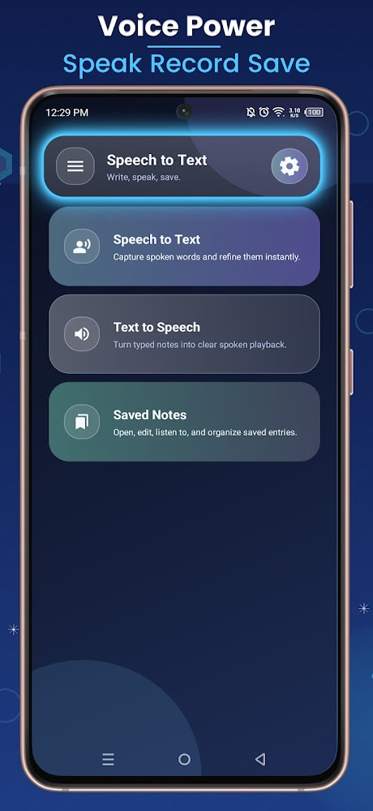
  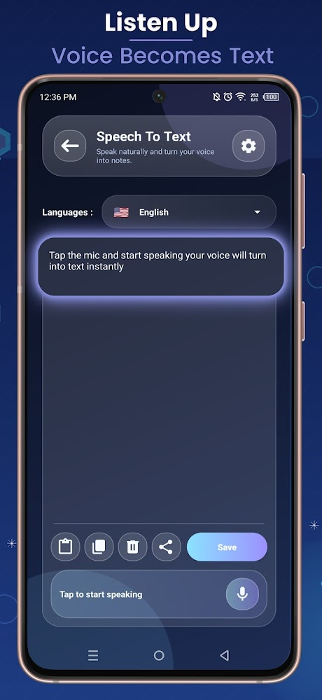
  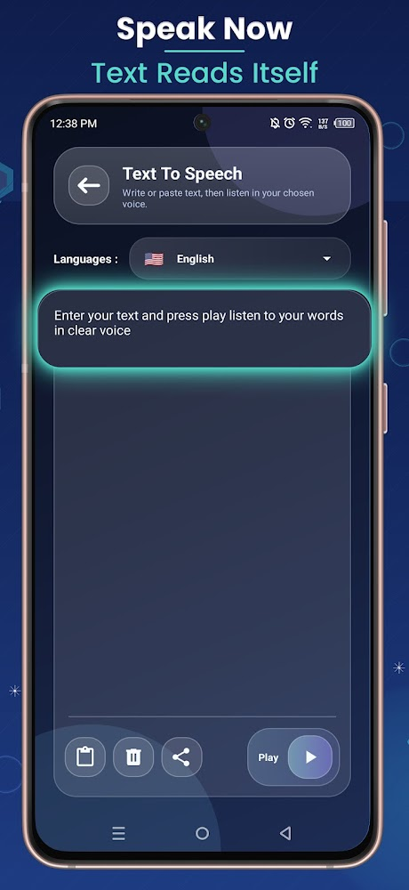

  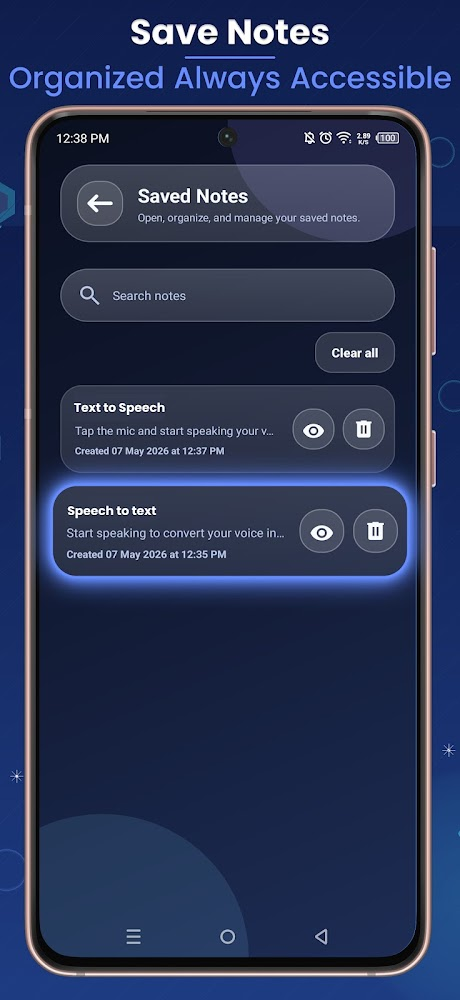
  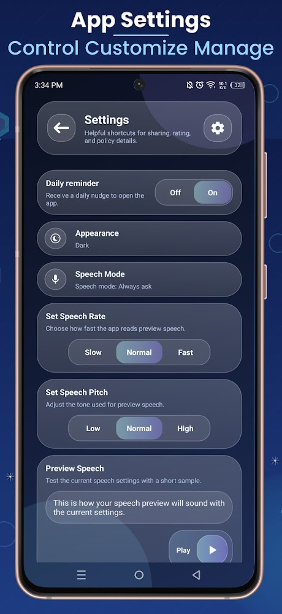
  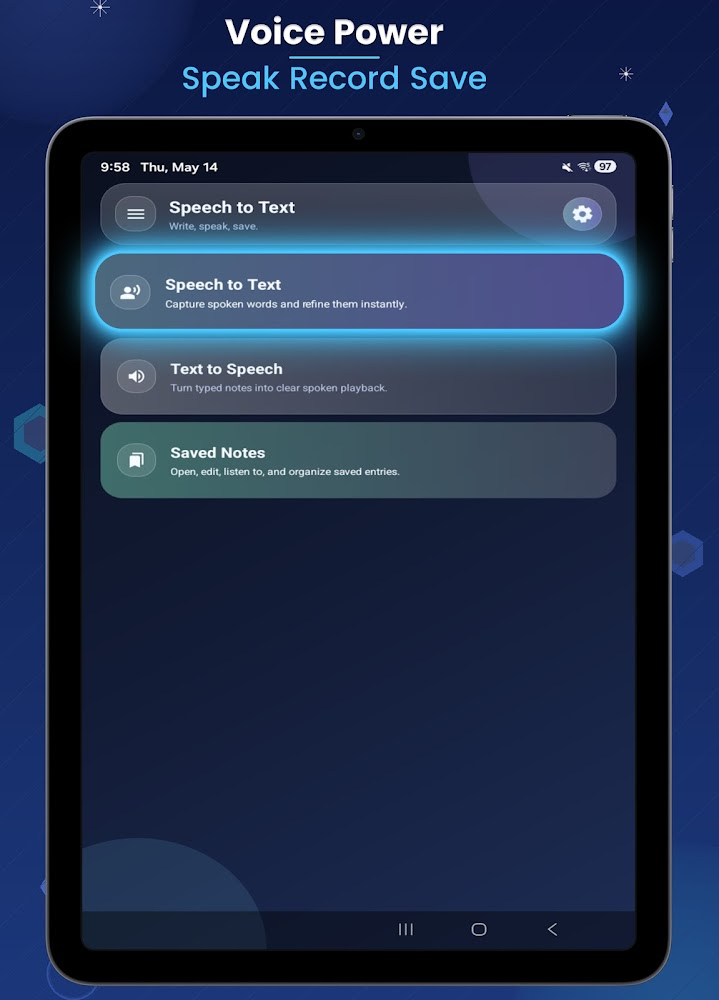

  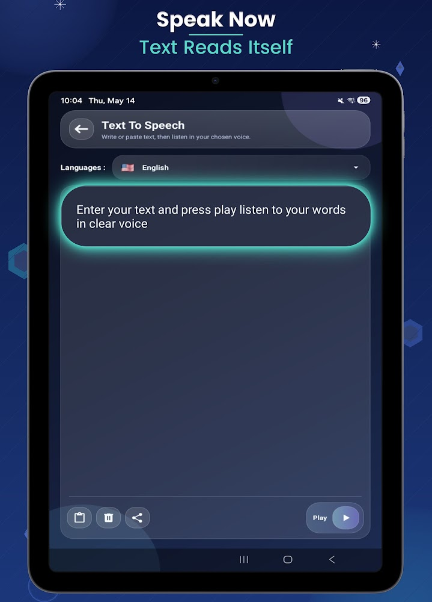
  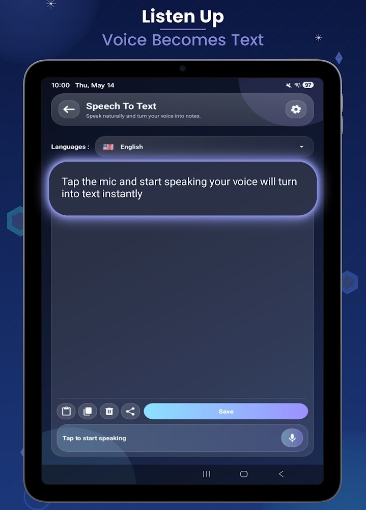
  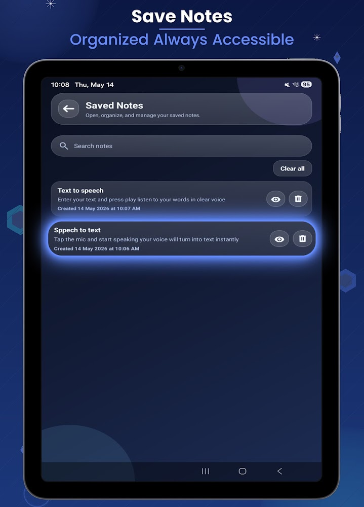

  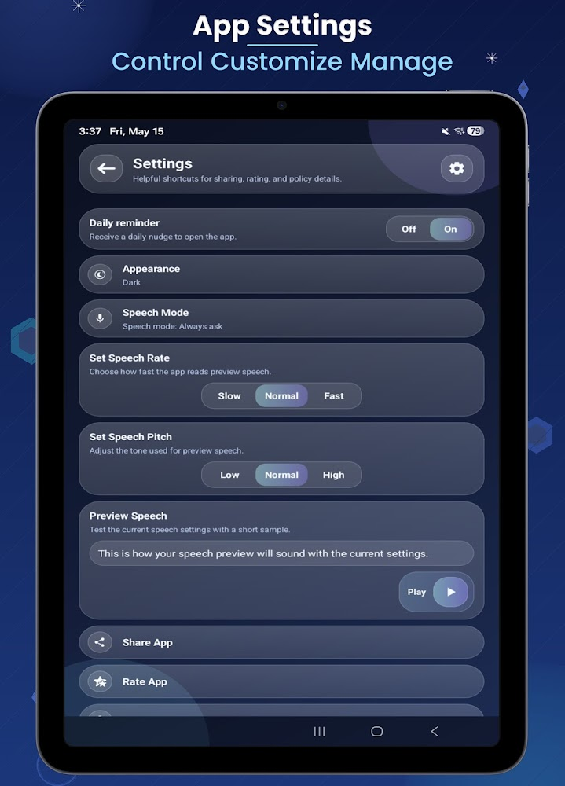
  
  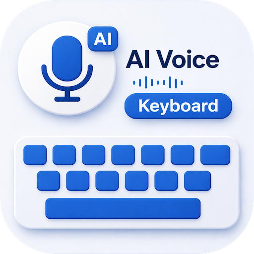

## 🏢 Project Details
* **Role:** Lead Developer (Java to Kotlin Migration & Full-Stack Development)
* **Company:** Zeesoft Tech
* **Availability:** Available on the Google Play Store (**500K+ Downloads**), [**Download Now**](https://play.google.com/store/apps/details?id=com.speechtotext.converter.app&hl=en)